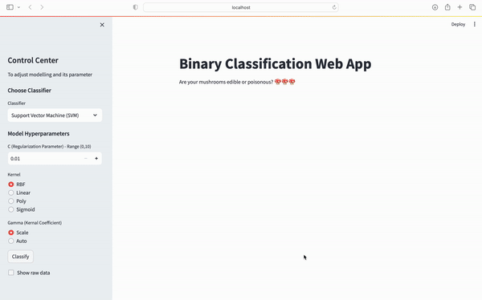

# Prediction-on-Streamlit

## 👨🏻‍💻 Introduction

Streamlit is an open-source Python library designed for creating web applications with minimal effort. It simplifies the process of turning data scripts into shareable web applications by providing a user-friendly and interactive interface. In this project, a beautiful and interactive web apps has been created. It generates dashboard in less than 100 lines of Python code without any prior web development experience and allow users to choose what classification algorithm and its hyperparameter they want to use, all without them knowing to code! 

## 📝 Install and Clone

GitPython and its required package dependencies can be installed as below: 

`pip3 install virtualenv`

`virtualenv my_env` 

`source my_env/bin/activate`

Run the following commands to receive the project, and rename it to proper name, and finally move into that directory by running followings:

`git clone https://github.com/LimKimHoong/Prediction-on-Streamlit.git`

`mv Prediction_on_Streamlit`

`cd Prediction_on_Streamlit`

installing the requirements for the project :

`pip install -r requirements.txt`

## 🏃🏻‍♂️ Run the web-app
To quickly run the web app, we need to run the `app.py` file, by the following code in the terminal: 

`streamlit run app.py`

Thus, a web browser will be opened. 

## ✋🏻 Stop the web-app 
Once you’ve had a chance to run and play around with the application, please press `Crtl` (a.k.a. control (^) for Mac) and `C` at the same time to stop the container and continue the project (as it is also mentioned in terminal).

## 💁🏻‍♂️ Contributing
Welcome any and all contributions! Here are some ways you can get started:
1. Report bugs: If you encounter any bugs, please let me know. Open up an issue and let me know the problem.
2. Contribute code: If you are a developer and want to contribute, follow the instructions below to get started!
3. Suggestions: If you don't want to code but have some awesome ideas, open up an issue explaining some updates or imporvements you would like to see!
4. Documentation: If you see the need for some additional documentation, feel free to add some!

## 🪪 License
This project is licensed under the [MIT License](https://opensource.org/license/mit/) - see the LICENSE file for details.
